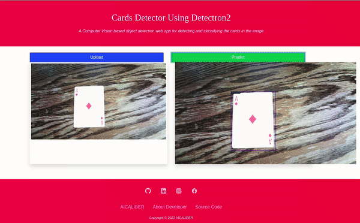
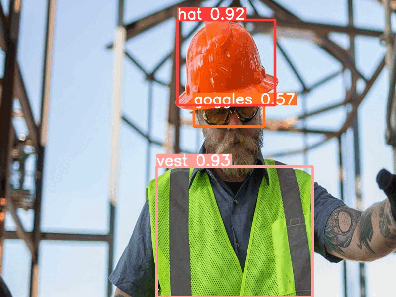

<p align="center">
    <b>
        <h1 align="center">🧑🏻‍🏭 Warehouse Apparel Detector 👨🏻‍🔧</h1>
    </b>
</p>
<!-- <p align="center">
    <em>A Vision AI based object detection web app to detect the warehouse apparel present in the image</em>
</p> -->
<p align="center">
<a href="https://github.com/Hassi34/Warehouse-Apparel-Detector-YOLOv5">
    
</a>
<a href="https://github.com/Hassi34/Warehouse-Apparel-Detector-YOLOv5">
    
</a>
</p>

<p align="center">
    <a href="https://github.com/Hassi34/Warehouse-Apparel-Detector-YOLOv5/blob/main/LICENSE">
        
    </a>
    <a href="https://github.com/Hassi34/Warehouse-Apparel-Detector-YOLOv5">
        
    </a>
    <a href="https://github.com/Hassi34/Warehouse-Apparel-Detector-YOLOv5">
        
    </a>
    <a href="https://github.com/Hassi34/Warehouse-Apparel-Detector-YOLOv5">
        
    </a>
</p>
<p align="center">
    
    
</p>

## Overview
This is a web app empowered by Vision AI to detect the warehouse apparel in the image.The model is trained using YOLOv5.After successful deployment of the application, the REST API for the service will be exposed to the web so users can use the web interface or the REST API.<br>
Following are the major contents to follow, you can jump to any section:

>   1. [Run Locally](#run-local)
>   2. [Model Training](https://github.com/Hassi34/Warehouse-Apparel-Detector-YOLOv5/blob/main/Yolov5_custom_training.ipynb)
>   3. [REST API](#rest-api)

## Run Locally<a id='run-local'></a>

Clone the project

```bash
  git clone https://github.com/Hassi34/Warehouse-Apparel-Detector-YOLOv5.git
```

Go to the project directory

```bash
  cd Warehouse-Apparel-Detector-YOLOv5
```

Install dependencies

```bash
  pip install -r requirements.txt
```

Start the server

```bash
  python app.py
```
## REST API<a id='rest-api'></a>
```python
import requests
import base64

IN_IMG_PATH = "./in.jpg"
OUT_IMG_PATH = "./out.jpg"
ENDPOINT = "http://127.0.0.1:5000/predict"

def decodeImage(imgstring, OUT_IMG_PATH):
    imgdata = base64.b64decode(imgstring)
    with open(OUT_IMG_PATH, 'wb') as f:
        f.write(imgdata)
        f.close()


def encodeImageIntoBase64(IN_IMG_PATH):
    with open(IN_IMG_PATH, "rb") as f:
        return base64.b64encode(f.read())

if __name__ == '__main__':

    BASE64_STR = encodeImageIntoBase64(IN_IMG_PATH).decode("utf-8")
    res = requests.post(ENDPOINT, json={"image":BASE64_STR})

    if res.status_code == 200:
        res = res.json()
        decodeImage(res["image"], OUT_IMG_PATH)
    else :
        print(res)
```
#### **Thank you for visiting 🙏 I hope you found this project useful**<br><br>

**Copyright &copy; 2022 Hasanain** <br>
Let's connect on **[``LinkedIn``](https://www.linkedin.com/in/hasanain-mehmood)** <br>